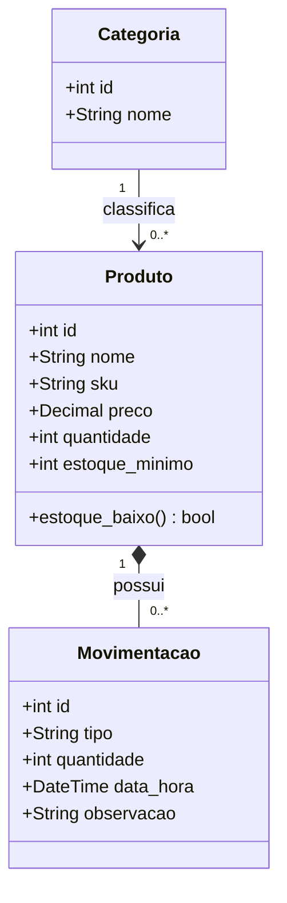
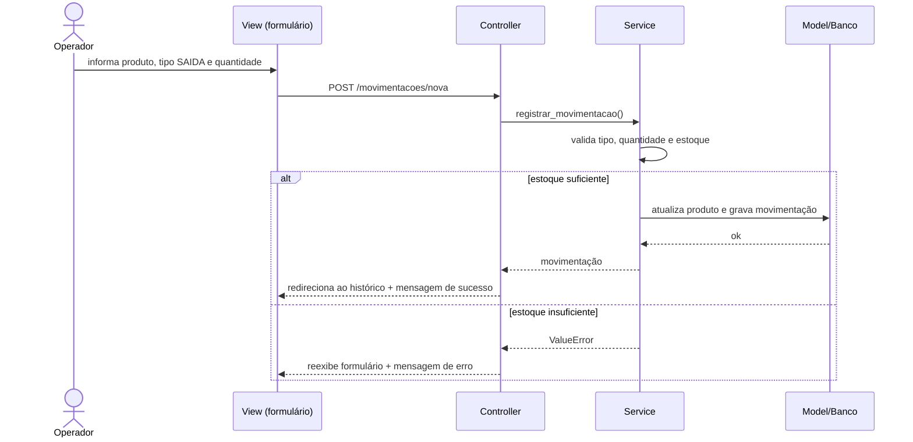
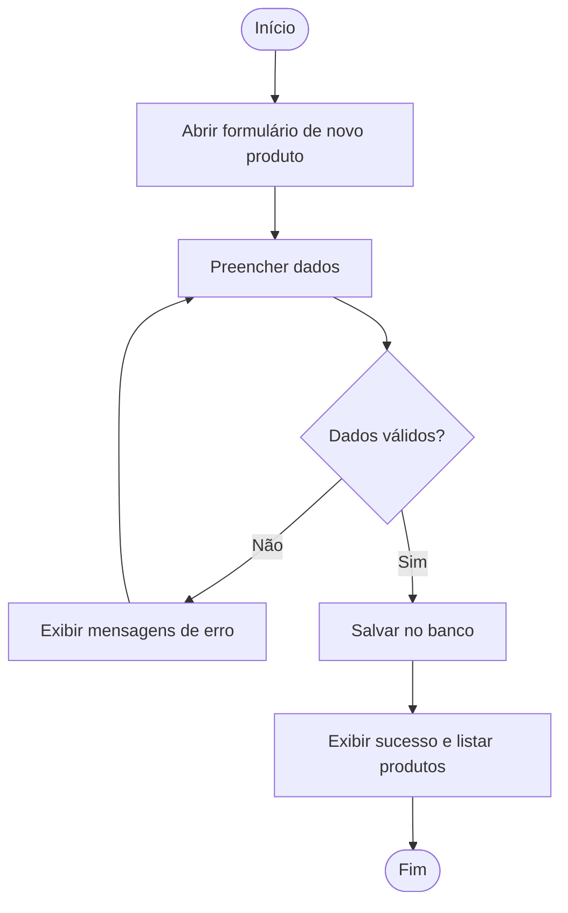

# 3. Diagramas UML

## 3.1 Diagrama de Classes

```mermaid
classDiagram
    class Categoria {
        +int id
        +String nome
    }
    class Produto {
        +int id
        +String nome
        +String sku
        +Decimal preco
        +int quantidade
        +int estoque_minimo
        +estoque_baixo() bool
    }
    class Movimentacao {
        +int id
        +String tipo
        +int quantidade
        +DateTime data_hora
        +String observacao
    }
    Categoria "1" --> "0..*" Produto : classifica
    Produto "1" *-- "0..*" Movimentacao : possui
```

## 3.2 Diagrama de Sequência – Saída de estoque

```mermaid
sequenceDiagram
    actor O as Operador
    participant V as View (formulário)
    participant C as Controller
    participant S as Service
    participant M as Model/Banco
    O->>V: informa produto, tipo SAIDA e quantidade
    V->>C: POST /movimentacoes/nova
    C->>S: registrar_movimentacao()
    S->>S: valida tipo, quantidade e estoque
    alt estoque suficiente
        S->>M: atualiza produto e grava movimentação
        M-->>S: ok
        S-->>C: movimentação
        C-->>V: redireciona ao histórico + mensagem de sucesso
    else estoque insuficiente
        S-->>C: ValueError
        C-->>V: reexibe formulário + mensagem de erro
    end
```

## 3.3 Diagrama de Atividades – Cadastro de produto

```mermaid
flowchart TD
    A([Início]) --> B[Abrir formulário de novo produto]
    B --> C[Preencher dados]
    C --> D{Dados válidos?}
    D -- Não --> E[Exibir mensagens de erro] --> C
    D -- Sim --> F[Salvar no banco]
    F --> G[Exibir sucesso e listar produtos]
    G --> H([Fim])
```
